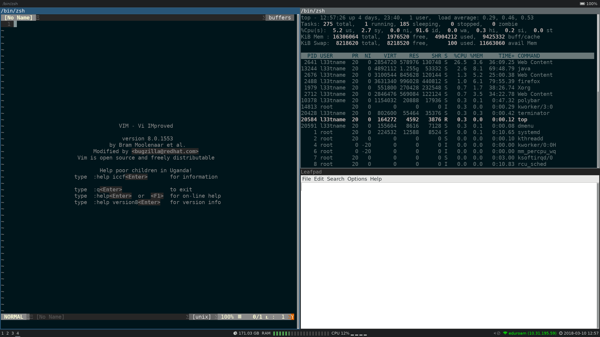

dotfiles
========

My personal dotfiles, always in work never finished.

```
sudo dnf install git
git clone https://github.com/fliiiix/dotfiles.git
cd dotfiles && ./bootstrap.sh
```



## Common Problems

**Q**: Something went wrong what now?  
**A**: just run `ansible-playbook -K laptop.yaml`

## Development

Feel free to fork it, test it and submit patches! Or just use it as base 
for your own dotfiles. Scripts are only testet with the Fedora versions I'm using.
